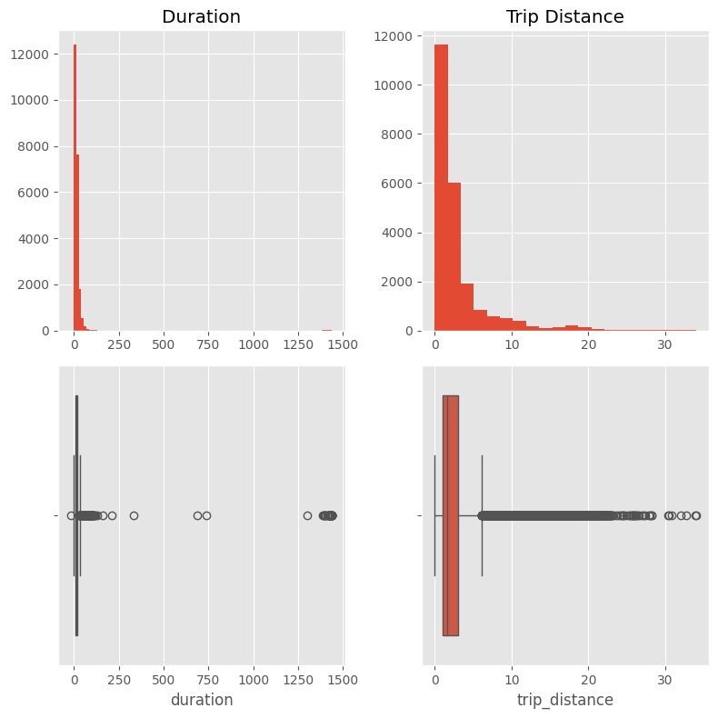

# Machine Learning Model to Predict Generous Customers

## 1. Overview

This project compares two alternative machine learning models, **XGBoost** and **Random Forest**, in order to find the best predictor for the problem of identifying *generous* customers. For the purpose of this project a customer will be classified as *generous* if their tip amount is equal or greater than 20% of the predicted fare for a given ride. Additionally, it is needed to train a linear regression model that estimates the fare before hand based on hte pickup and drop off locations. 

The analysis shows that the biggest factor for deciding if the tip is going to be above the *generosity threshold* is the `VendorID`. As surprising as this result is, it may point to a fundamental difference in service between the two companies involved that isn't captured in the data.

Further investigation is needed to determine the extent of these differences. A customer satisfaction survey could be a good way to gather data from a different source. All the data provided for this project comes from the transportation companies, not from the customers. 

## 2. Business Understanding

A transportation company is trying to identify if a customer is going to give a substantial tip. A priori, this sounds like a very subjective thing to try to predict from raw data. This project will show how it is possible to train a machine learning model that **performs 44% better** than a random guess.

For this project *generous* customers are those who tip more than 20% of the predicted fare. It has to be pointed out that *generous* is merely a label and by no means attempts to be a judgment of character for the customers. The threshold value of 20% is arbitrarily chosen.  

For a driver, knowing an estimation of the tip before hand will help him decide what ride to take. This gives a little priority to those clients who have a higher likelihood of paying more. 

If an app was intended to include this data, it would be important to be transparent. This could be by assigning a badge to those customers that are better tippers. In this project the only thing that will be studied is how the `tip_amount` relates to the data of a given ride, disregarding *who* is the client. It makes sense to think that clients that are better tippers will have a consistent tipping history. This feature could be added to the model to improve it's accuracy on later iteration. 

## 3. Data Understanding

The dataset contains data from **22699 different taxi rides**. The data is collected from two different vendors; 44% of the data corresponds to Vendor 1 and 56% to Vendor 2. Each observation has 17 distinct features some of which needed to be combined to create new features with higher predicting power. 

### 3.1 EDA and data cleaning

The data set contains a considerable number of outliers and *wrong values* like negative distances and negative durations. Before any analysis, the data needed to be cleaned by imputation. 

One of the correlations that appears in the preliminary analysis is the difference in tipping received by each of the vendors. 

### 3.2 Fare prediction

There is a clear linear relation between the mean duration of a ride and the fare amount. Mean duration and mean length are also highly correlated with each other. 

In the plot is possible to see two horizontal lines, one above $60 corresponding the the imputed outliers and the other **above $50** corresponding to the flat rate given to all **airport rides**. Knowing this the data can be later imputed improving the performance of the overall predictions.

This linear regression accounts for **84% of the variance** of the `fare_amount`. It is a good predictor having only the start and end of the ride as variables. 

The picture above shows the error distribution of the model. The bell shaped histogram informs us that the errors are randomly distributed and that there isn't a systematic error built in the model. 

This model predicts that the average increase in fare amount is of **$2.38 per mile** and **$0.23 per minute**.

## 4. Modeling and Evaluation

Both Gradient descent (`XGBoost`) and Random Forest methods were trained for this project in order to find the best performing model. It should be noted that the time efficiency of the model highly depends on the hyperparameter tuning stage (using `GridSearchCV`).

The metric that the models are going to be evaluated with is F1, the harmonic mean of precision and recall. The reason for this is that the model needs to equally avoid false positives and false negatives. Put simply false positives increase drivers malcontent by making them expect a higher tip than they will finally receive. On the other hand false negatives decrease the *preference* of a particular hight tipping customer being picked up, potentially reducing the tip due to the extended waiting time.

The difference in prediction power was marginal, **75.2% for the Random Forest** against **74.9% for XGBoost** on the test set. The greatest difference happened during the grid search, the Random Forest took more than an hour to tune making it unreasonable to further iterate the process to explore hyperparameters outside the grid search range.

Random forest was the one picked for evaluation, but if further iterations of the tuning process were to be done, XGBoost would be the more efficient solution. 

 

The matrix above shows that, even if none of the two outcomes was favored during training, the model is almost twice as likely to produce a false negative than a false positive. If our concerns about this kind of bias is correct, this model could increase driver's discontent making them expect a higher tip than they will receive, and ultimately stop using the service. 

One of the benefits of this tree based models is that one can take a look at the prediction power of each feature. For our Random Forest model the most salient feature is the `VendorID`. As mentioned before, there may be a fundamental difference in the service provided by the different vendors that could account for this disparity in tip amounts. One could say that the fact that there are above 2000 more observations corresponding to Vendor 2 could be a reason for this difference, but a closer look at the number of *generous* customers invalidates the argument. Assuming a homogeneous amount of *generous* customers in the city, 25 percent increase in observations would imply a similar increase in *generous* customers registered. This is the actual data:

- Vendor 1: 2072 *generous* customers 
- Vendor 2: 5947 *generous* customers

It's clear that there must be a difference that is not accounted for in the data.

## 5. Conclusion

It is possible to estimate the likelihood of a customer giving a substantial tip based on raw data related to the ride they are about to take. The model could be further improved by using more data, particularly data that informs about service quality and satisfaction. Other improvements could be the implementation of a customer database that keeps track of their tipping history.

When creating a model of this kind, I think it is important to test it in a real world scenario. Ultimately we are dealing with a very subjective individual choice, tipping, and the introduction of a prediction system could influence that sentiment in ways that can't be thought beforehand. One can't forget that this is an attempt to model a complex system and should look at it as what it it, a simplification. 